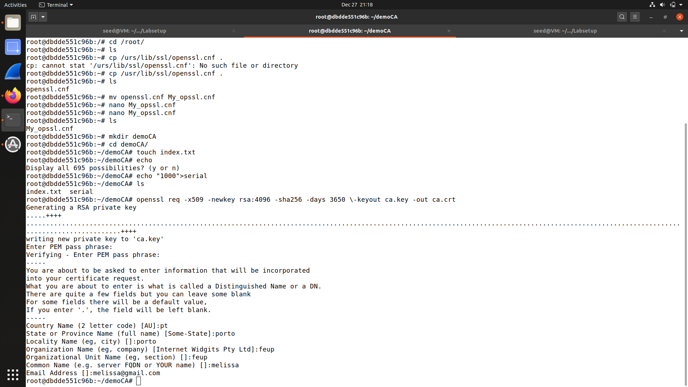
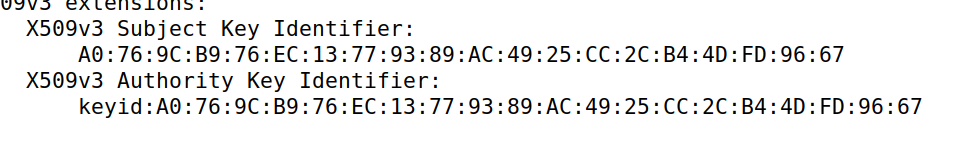
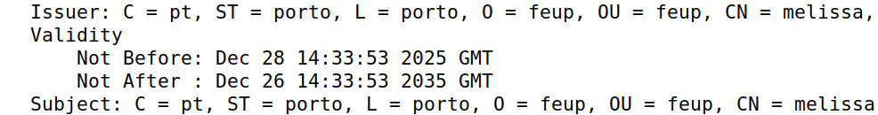
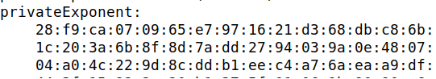
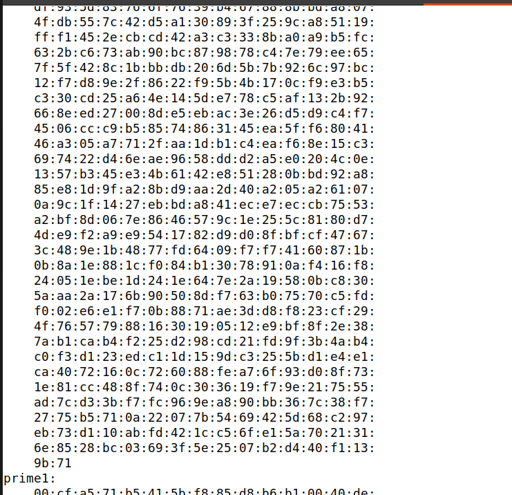
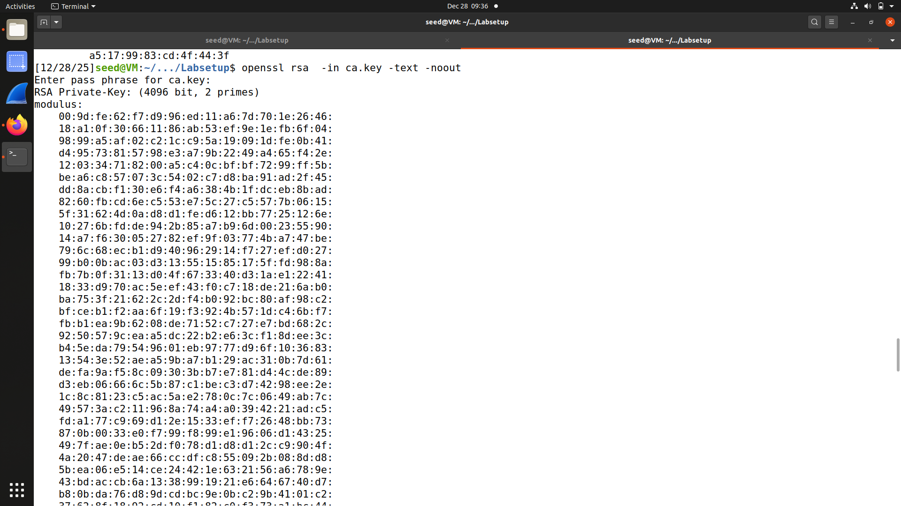
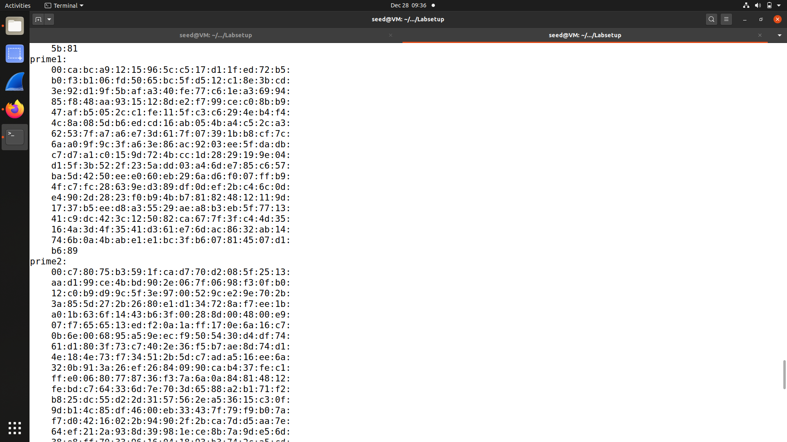
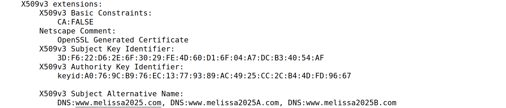
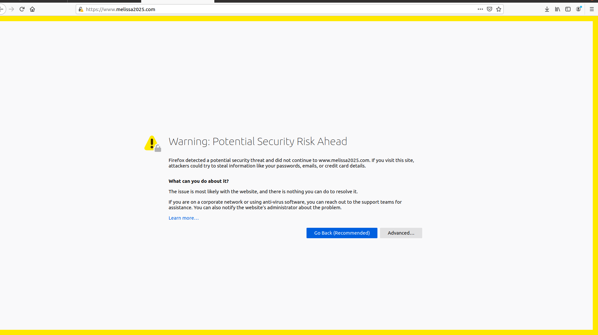
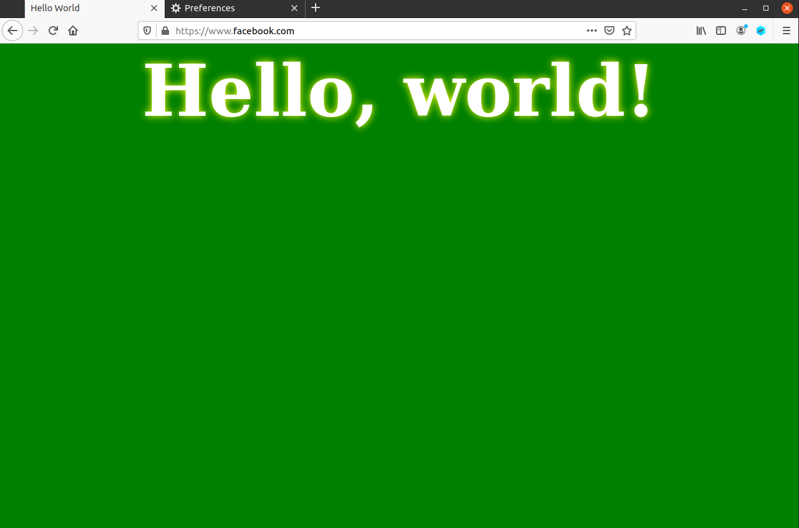

# LOGBOOK11

## Task 1
O primeiro passo para configurar uma Autoridade Certificadora (CA) é utilizar um ficheiro .conf. Para isso, copiámos o ficheiro padrão localizado em `/usr/lib/ssl/openssl.cnf ` para o nosso diretório de trabalho. Em seguida, criámos os diretórios e ficheiros necessários com os comandos `mkdir demoCA`, `cd demoCA`, `mkdir certs crl newcerts`, `echo 1000 > serial`, `touch index.txt`, e descomentando a linha       `#unique_subject = no` 



O próximo passo é gerar um certificado autoassinado para a CA com o seguinte comando, que já especifica os valores necessários:

```
openssl req -x509 -newkey rsa:4096 -sha256 -days 3650 \
-keyout ca.key -out ca.crt \
-subj "/CN=www.modelICA.com/0=Model CA LTD./C=US" \
-passout pass:dees
```


Para decodificar o certificado gerado, executamos `openssl x509 -in ca.crt -text -noout` para decodificar o certificado de chave pública e `openssl rsa -in ca.key -text -noout` para decodificar a chave privada da CA.

> Que parte do certificado indica que este é um certificado de CA?

The  and  match, and in  CA is TRUE, indicating it is a self-signed certificate.

Os campos `Subject Key Identifier` e `Authority Key Identifier` são iguais e, na secção "Basic Contraints", o campo CA: TRUE indica que este certificado pertence a uma Autoridade Certificador



> Que parte do certificado indica que este é um certificado autoassinado?

Quando os campos Issuer e Subject são iguais, isso indica que o certificado é autoassinado



>No algoritmo RSA, temos um expoente público e, um expoente privado d, (...)
> 



> a modulus n, (...)
> 



> e dois números secretos p e q, de forma que n = pq. Por favor, identifique os valores desses elementos em seus arquivos de certificado e chave.



## Task 2

Para criar o certificado do servidor, bem como os nomes alternativos (SAN) necessários para tarefas posteriores, executámos o seguinte comando:~
 Usar `-addext` (OpenSSL 1.1.1+):
     ```
     openssl req -new -newkey rsa:2048 -nodes \
       -keyout server.key -out server.csr \
       -subj "/CN=www.melissa.com" \
       -addext "subjectAltName = DNS:www.melissa.com, DNS:www.melissa2025.com"
     ```


## Task 3

Para permitir que os campos de extensão sejam copiados para o certificado final, foi necessário editar o ficheiro `openssl.cnf` (copiado na Tarefa 1) e descomentar a linha:  `copy_extensions = copy`.

Em seguida, foi executado o comando para gerar o certificado X.509 a partir do CSR:

```
openssl ca -config openssl.cnf -policy policy_anything \
-md sha256 -days 3650 \
-in server.csr -out server.crt -batch \
-cert ca.crt -keyfile ca.key
```

>Após assinar o certificado, por favor use o seguinte comando para imprimir o conteúdo decodificado do certificado e verificar se os nomes alternativos estão incluídos.
>`openssl x509 -in server.crt -text -noout`

Na seção *X509v3 extensions*, os nomes alternativos estão listados.


## Task 4

Nesta tarefa, configurámos um servidor HTTPS utilizando certificados dentro do container. Para isso, foi necessário editar o ficheiro `bank32_apache_ssl.conf`, alterando (ou verificando) os campos ServerName e ServerAlias. Como foi utilizado o nome padrão, não foram necessárias alterações adicionais.

imagem

Em seguida, executámos os seguintes comandos para ativar o SSL, o site e iniciar o Apache:


```
root@6458d7b52a25:/# a2enmod ssl
Considering dependency setenvif for ssl:
Module setenvif already enabled
Considering dependency mime for ssl:
Module mime already enabled
Considering dependency socache_shmcb for ssl:
Module socache_shmcb already enabled
Module ssl already enabled
root@6458d7b52a25:/# a2ensite bank32_apache_ssl
Site bank32_apache_ssl already enabled
root@6458d7b52a25:/# service apache2 start
 * Starting Apache httpd web server apache2
 Enter passphrase for SSL/TLS keys for www.bank32.com:443 (RSA):
 * 
```


Inicialmente, não foi possível aceder ao website, pois o navegador não confia na CA que assinou o certificado do servidor

Para corrigir o problema, importámos o certificado da CA no navegador Firefox através do caminho:

Preferências → Privacidade & Segurança → Ver Certificados → Importar

Após isso, o website HTTPS passou a ser acessível normalmente.


## Task 5

Após adicionar a entrada `10.9.0.80 www.melissa.com` no arquivo /etc/hosts, ao tentar acessar o site `https://www.melissa.com` recebemos o seguinte erro:



Isto ocorre porque o certificado apresentado não corresponde ao domínio real, alertando o utilizador de que o website pode estar comprometido.

## Task 6

Nesta tarefa, foi desenhada uma experiência para demonstrar que um atacante pode realizar um ataque Man-In-The-Middle (MITM) sem levantar suspeitas no navegador.

Foi adicionada a seguinte entrada no ficheiro /etc/hosts:

`10.9.0.80 www.facebook.com`


Em seguida, foi criado um novo certificado para o servidor Apache, incluindo o domínio www.facebook.com
 nos Subject Alternative Names:

```
 -addext "subjectAltName = DNS:www.melissa2025.com, \
DNS:www.melissa2025A.com, \
DNS:www.melissa2025B.com, \
DNS:www.facebook.com"
```


Com este certificado, o navegador não apresenta avisos de segurança, demonstrando que um atacante com uma CA confiável pode executar um ataque MITM com sucesso.

