# LOGBOOK 13 - (Packet Sniffing and Spoofing)

## Configuração Inicial

A configuração básica dos containers Docker:

* Iniciamos os containers com `dcbuild` e `dcup`.
* Identificamos o nome da interface de rede atribuída.

O arquivo `docker-compose.yml` inicia 3 containers, sendo os principais o **Attacker** e o **Host B**. O container do atacante possui uma pasta compartilhada `volumes` e opera em `network_mode: host` (sub-rede 10.9.0.0/24).

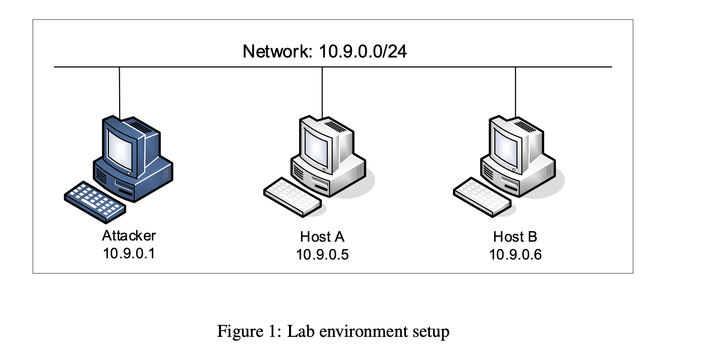

Para obter o nome da interface, executamos o comando`ifconfig` fora dos containers e procuramos pela interface com o IP `10.9.0.1`.

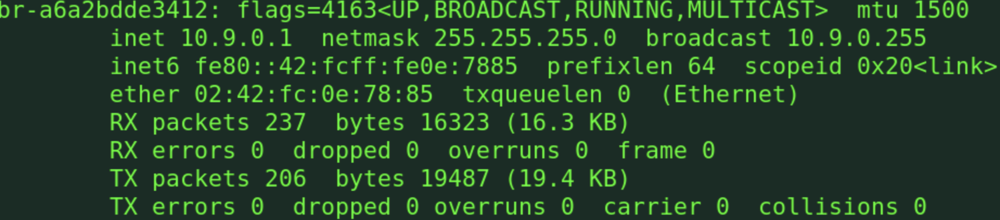

## Tarefa 1.1: Sniffing de Pacotes

O objetivo é aprender a interceptar (sniff) pacotes usando a biblioteca Scapy do Python.

### Tarefa 1.1A

Para interceptar pacotes ICMP entre o Host A e o Host B a partir do container Attacker:

1. Encontramos a interface de rede (como visto na configuração inicial).
2. Usamos o seguinte script:

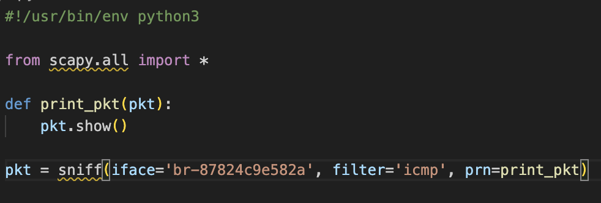

Para executar entramos no container (`docksh <id>`), demos permissão de execução (`chmod a+x`) e rodamos o script. Ao pingar o Host A a partir do Host B, o script imprimirá os pacotes capturados, detalhando as camadas Ethernet, IP, ICMP e Raw.

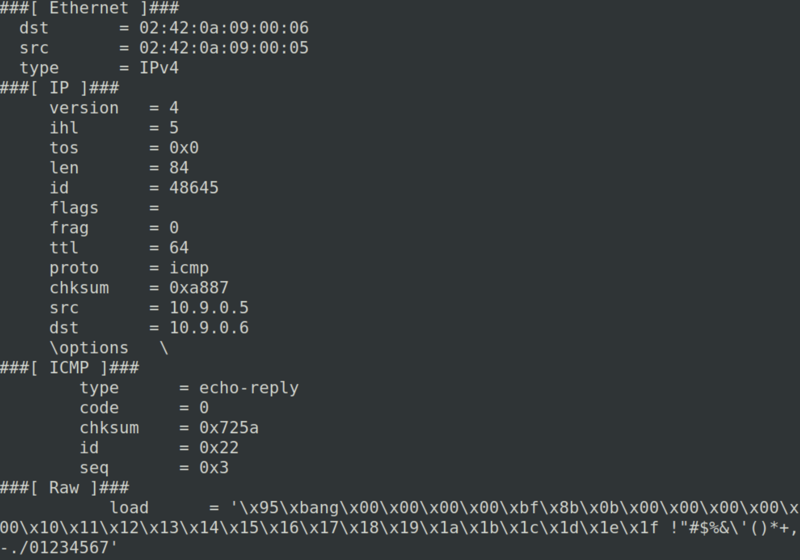

### Tarefa 1.1B

Esta etapa foca no uso de filtros BPF (Berkeley Packet Filter) para refinar a captura. O script abaixo permite filtrar por ICMP, TCP (porta específica) ou Sub-rede:

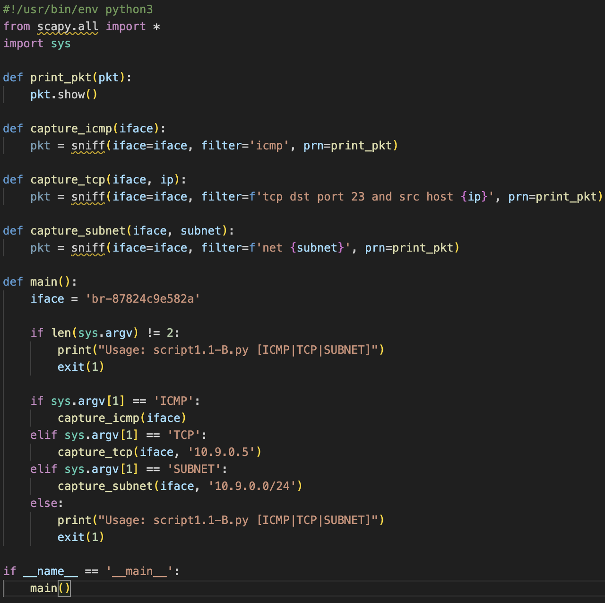

* **ICMP:** Captura padrão de pings.
* **TCP:** O filtro `tcp dst port 23 and src host 10.9.0.5` captura tráfego Telnet vindo de um IP específico.
* **Sub-rede:** O filtro `net 10.9.0.0/24` captura todo tráfego originado ou destinado a essa sub-rede.

## Tarefa 1.2: Spoofing de Pacotes ICMP

O objetivo é forjar (spoof) um pacote ICMP do Host A para o Host B.

### Script Python

Usamos um script definindo manualmente o IP de origem (`src`) como sendo o Host A, mesmo enviando do container Attacker:

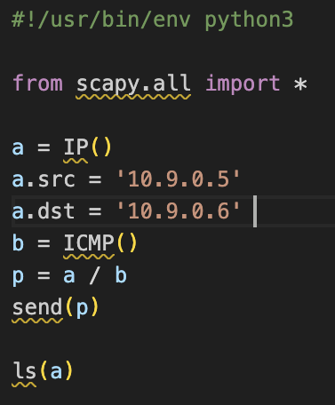

### Execução e Resultados

1. No Host B, iniciamos o monitoramento com `tcpdump -i any icmp -n`.
2. No Attacker, rodamos o script Python.

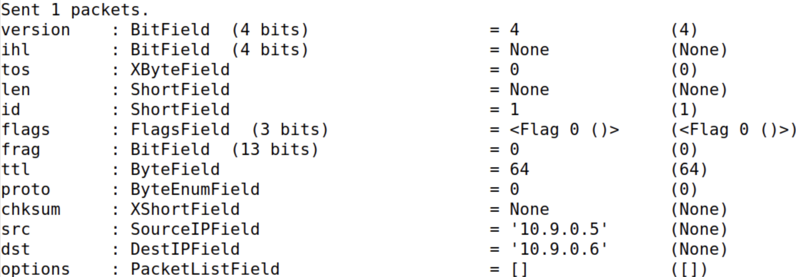

No Host B, o tcpdump confirma o recebimento de uma requisição vinda de `10.9.0.5` (falsificado) e envia a resposta para esse IP.

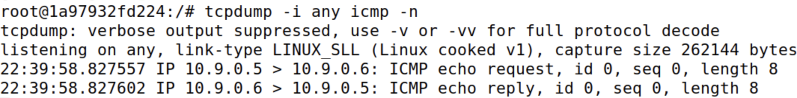

## Tarefa 1.3: Traceroute

Implementamos uma ferramenta de traceroute customizada manipulando o campo TTL (Time To Live) dos pacotes IP para estimar a distância até um destino.

### Script Python

O script envia pacotes incrementando o TTL em um loop até que a fonte da resposta seja o destino final (`8.8.8.8`).

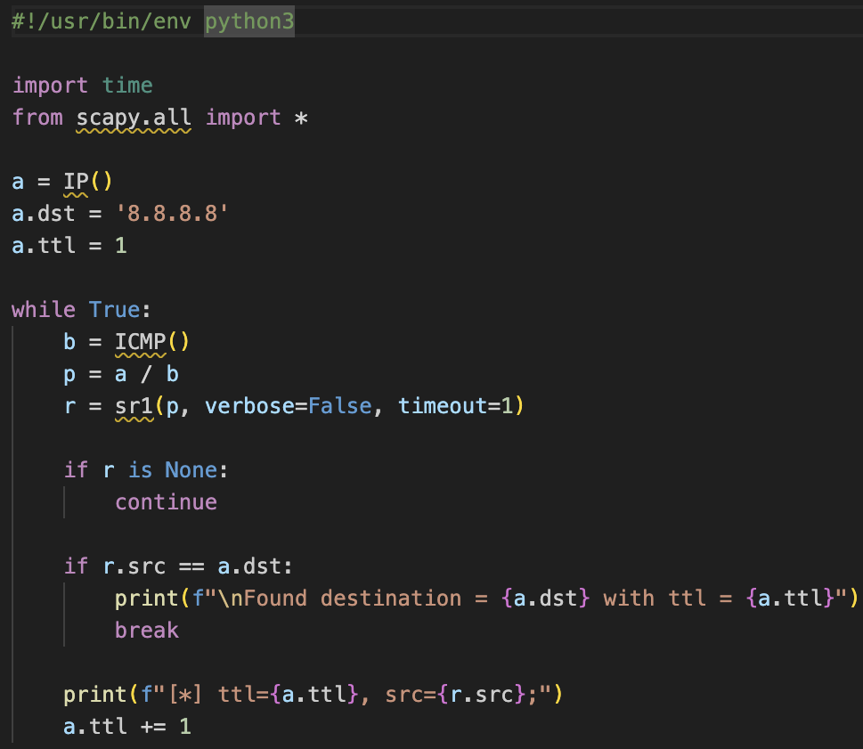

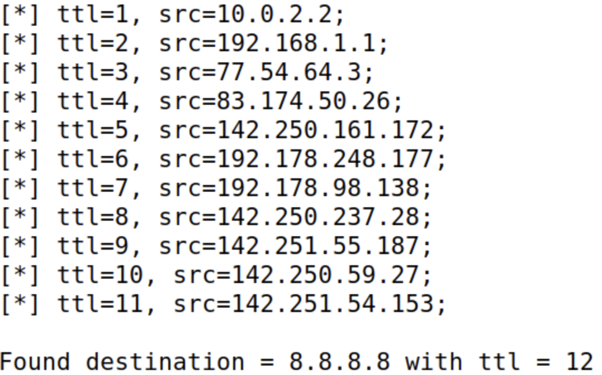

O resultado mostra que o destino `8.8.8.8` foi alcançado após **12 saltos**.

## Tarefa 1.4: Sniffing e depois Spoofing

O objetivo é interceptar pacotes (sniff) do Host B e responder imediatamente com pacotes falsificados (spoof).

### Script Python

O script escuta requisições ICMP e usa os dados do pacote capturado para montar e enviar uma resposta falsa invertendo origem e destino.

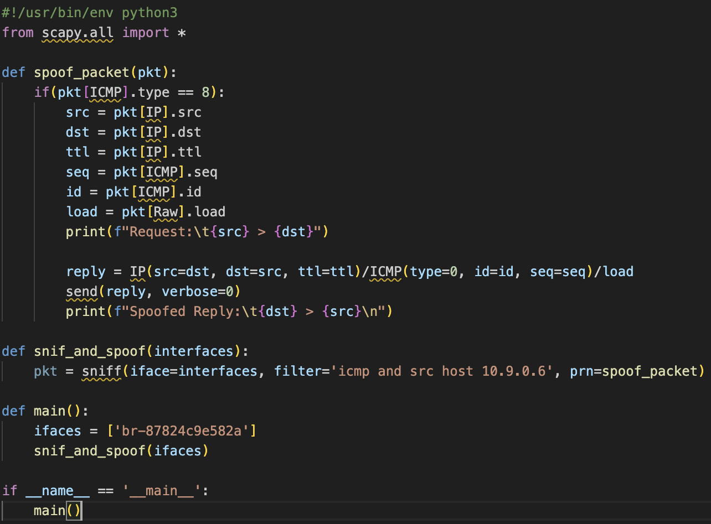

### Exemplos e Observações

Testamos 3 cenários disparando pings do Host B enquanto o script rodava no Attacker.

#### Exemplo 1: `1.2.3.4` (Host inexistente na Internet)

O ping funciona. Como o host não existe, o roteador encaminha o pacote para o gateway (onde nosso atacante está escutando). O script captura e envia a resposta falsa.

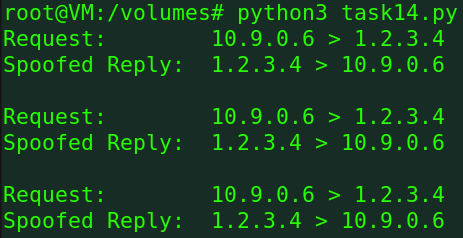
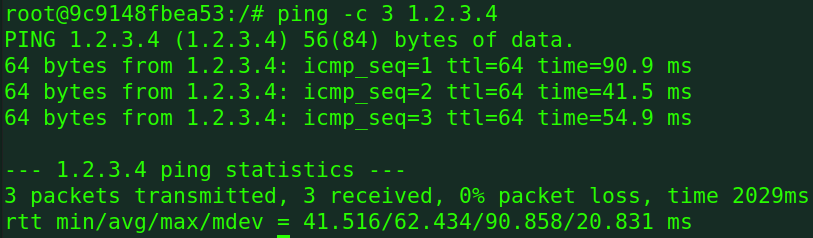
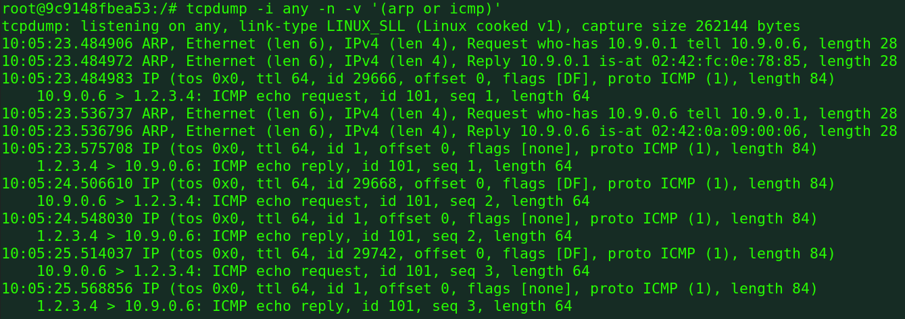
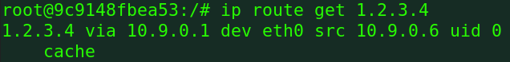

#### Exemplo 2: `10.9.0.99` (Host inexistente na LAN)

O ping falha (`Destination Host Unreachable`). Como o IP está na mesma sub-rede, o Host B tenta descobrir o MAC via ARP. Como ninguém responde ao ARP, o pacote ICMP nunca é enviado, logo o atacante não consegue interceptar nem responder.

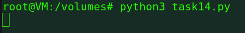
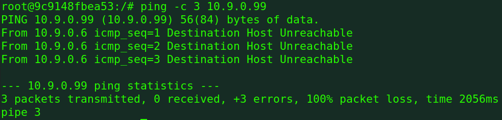
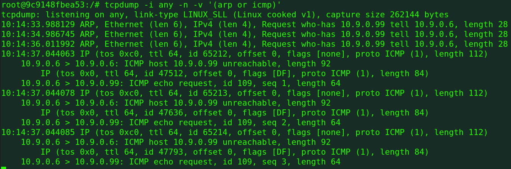
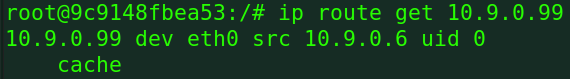

#### Exemplo 3: `8.8.8.8` (Host real na Internet)

Recebemos respostas duplicadas (`DUP!`). O pacote passa pelo atacante (que envia a resposta falsa imediatamente) e segue para a internet (onde o servidor real 8.8.8.8 também responde). O Host B recebe ambas as respostas.

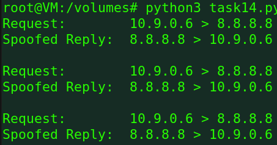
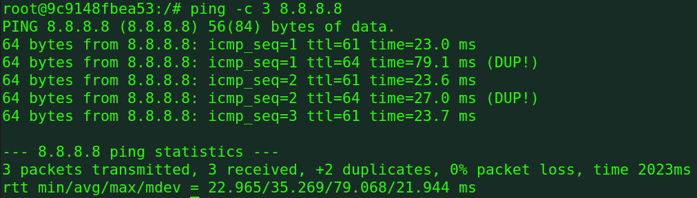
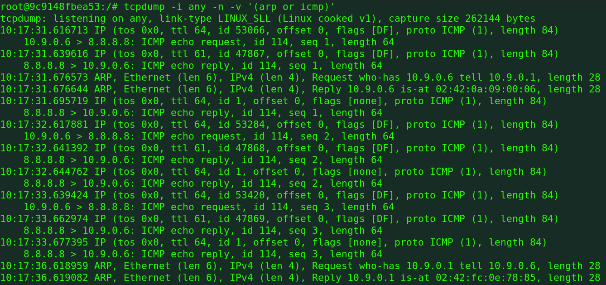
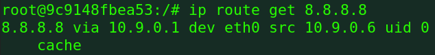