# **2.1 Task 1: Manipulating Environment Variables**

Os comandos abaixo permitem visualizar, adicionar e remover variáveis de ambiente no sistema:

**printenv** e **env**: mostram todas ou apenas algumas variáveis de ambiente.

**export**: adiciona uma variável ao ambiente atual, tornando-a visível a processos filhos.

**unset**: remove uma variável do ambiente.

Estas variáveis influenciam o comportamento de comandos (por exemplo, `PATH` muda onde o sistema procura binários).

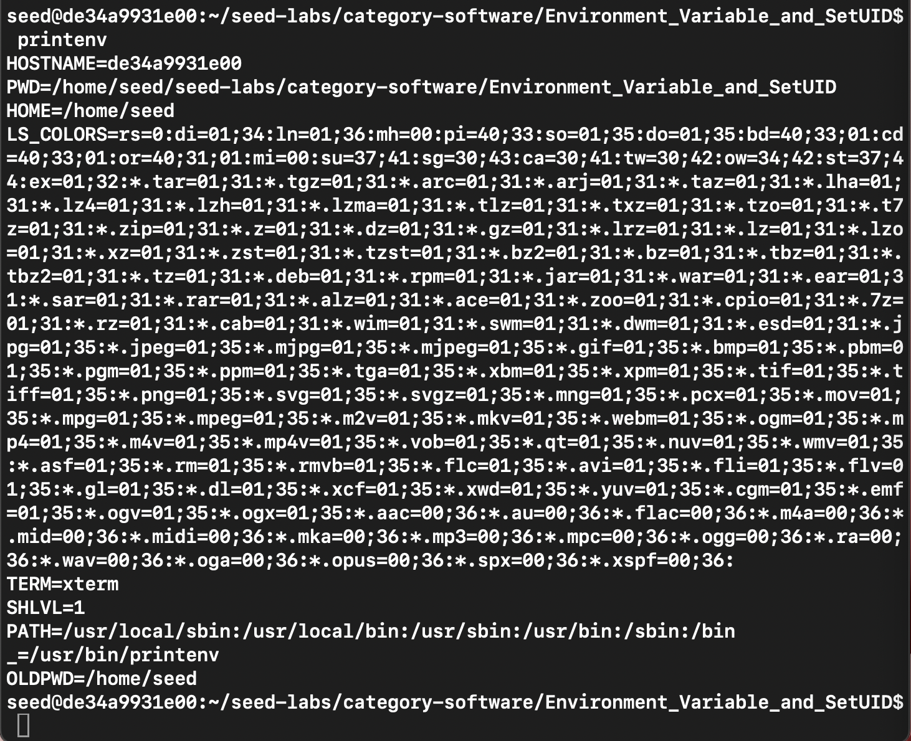
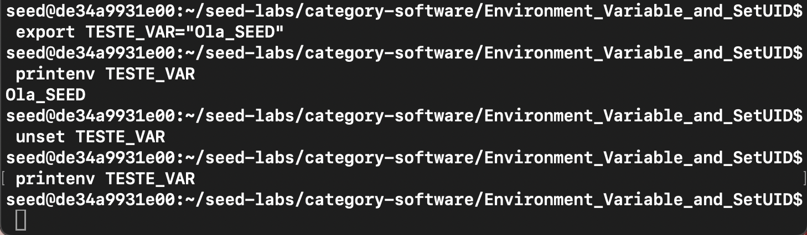

# **2.2 Task 2: Passing Environment Variables from Parent Process to Child Process**

Verifica se as variáveis de ambiente do processo pai são herdadas pelo processo filho após a execução de `fork()`.

**Step 1 – Child Process**

O ficheiro `myprintenv.c` (fornecido no Labsetup.zip) foi compilado e executado para imprimir as variáveis de ambiente do processo filho.
O programa cria um processo filho com `fork()`. O filho chama `printenv()`, que lista todas as variáveis de ambiente herdadas.
O output foi redirecionado para `child_env.txt`.

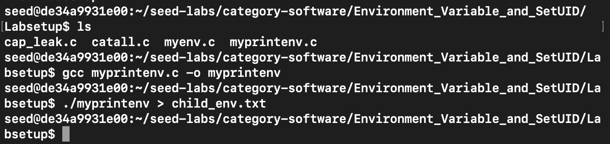

**Step 2 – Parent Process**

Alterou-se o código para desativar a impressão no processo filho e ativar no processo pai.
O output foi guardado em `parent_env.txt`.

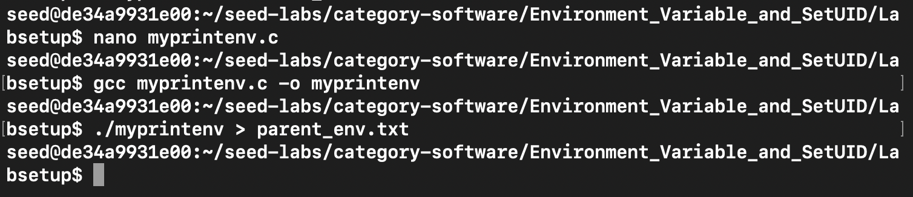

**Step 3 – Comparison**

Os dois ficheiros foram comparados com o comando:

`diff child_env.txt parent_env.txt`

Nenhuma diferença foi listada.

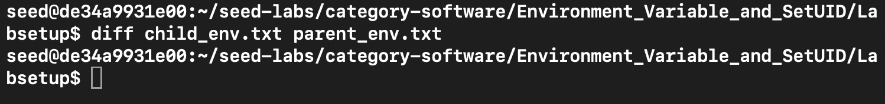

O resultado mostra que as variáveis de ambiente do pai e do filho são idênticas, logo:
o processo filho herda todas as variáveis de ambiente do processo pai após a chamada a `fork()`.

# **2.3 Task 3: Environment Variables and `execve()`**

Analisa como o `execve()` afeta as variáveis de ambiente ao executar um novo programa.

**Step 1**

Foi compilado o ficheiro `myenv.c` e executado com `NULL` como terceiro argumento da função `execve()`.

O programa não apresentou variáveis de ambiente, indicando que `execve()` não as passa automaticamente quando o argumento envp é `NULL`.

**Step 2**

O código foi alterado para usar:

`execve("/usr/bin/env", argv, environ)`;

O programa mostrou todas as variáveis de ambiente (`PATH`, `PWD`, `HOME`, etc.), confirmando que environ contém o ambiente do processo atual.

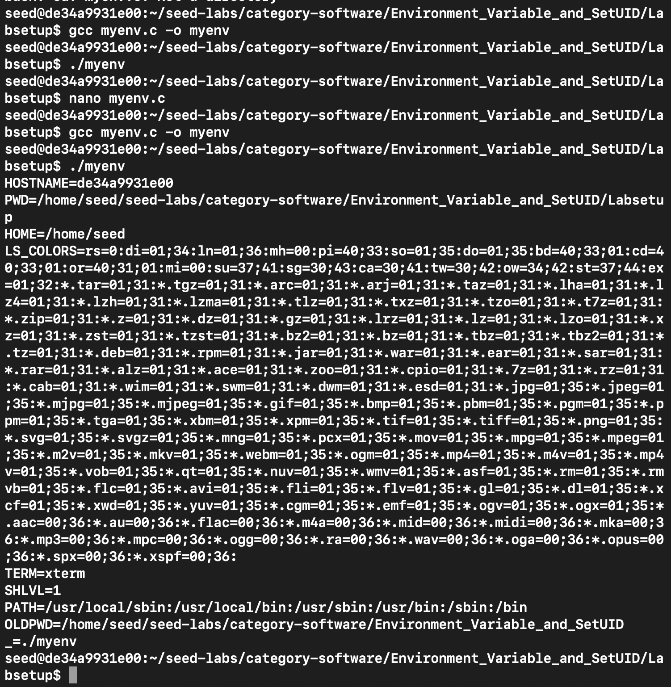

Quando se usa `execve()`, o novo programa só herda as variáveis de ambiente se forem explicitamente passadas.
Passar `NULL` resulta num ambiente vazio; passar environ preserva o ambiente do processo original.

# **2.4 Task 4: Environment Variables and `system()`**

Analisar como a função `system()` trata as variáveis de ambiente quando executa um novo programa.

O programa `system_env.c` foi compilado e executado para correr o comando `/usr/bin/env` através da função `system()`.

A função `system()` executa internamente `/bin/sh -c`, e o sh herda as variáveis de ambiente do processo que a invoca.
Assim, as variáveis do processo original são automaticamente transmitidas ao novo programa.

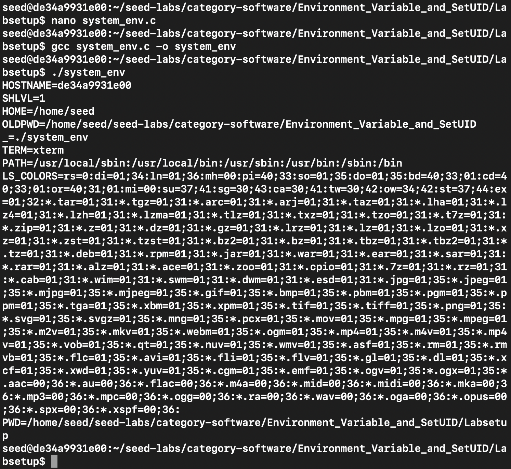

# **2.5 Task 5: Environment Variable and Set-UID Programs**

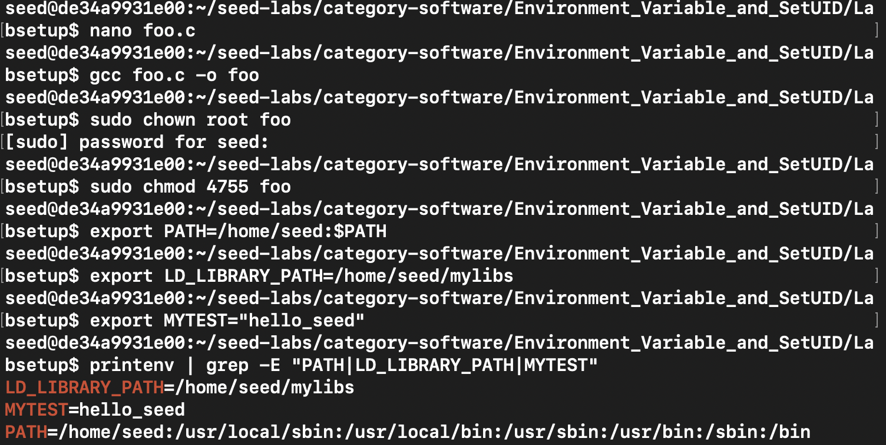

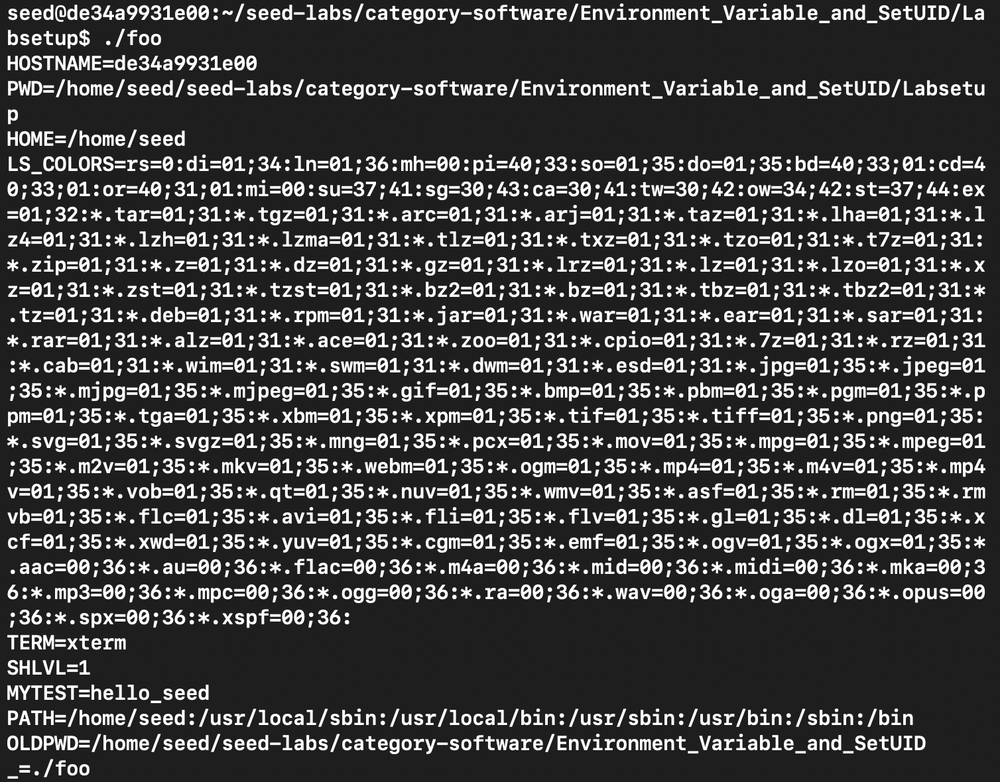

O output mostra variáveis como `PATH`, `PWD`, `HOME` e `MYTEST`.
No entanto, variáveis como `LD_LIBRARY_PATH` não são exibidas — são removidas automaticamente para evitar ataques de manipulação de bibliotecas em programas Set-UID.

# **Task 6: The PATH Environment Variable and Set-UID Programs**

## Preparação do binário vulnerável
Foi compilado um programa `vuln_ls.c` que usa `system("ls")` e um pequeno `ls` malicioso para testar.

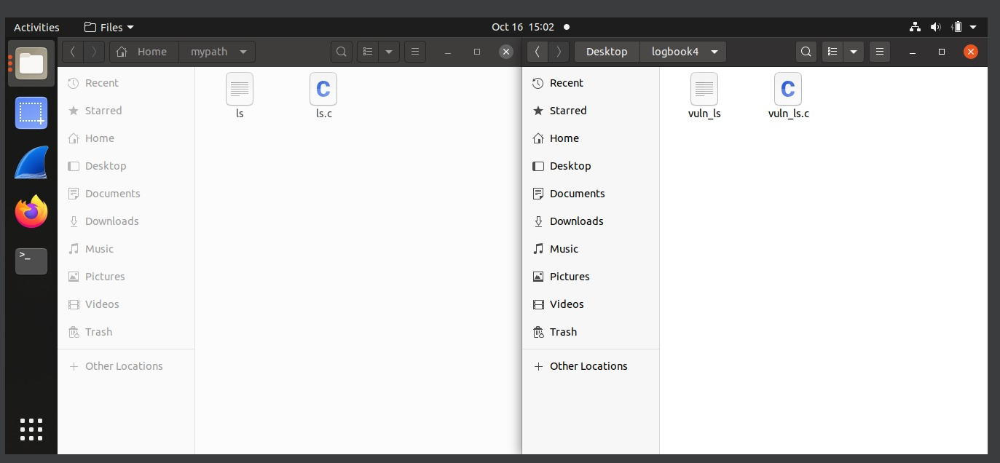

## Configuração: Set-UID, PATH e shell
O binário `vuln_ls` foi tornado Set-UID root; foi colocada uma versão maliciosa de `ls` num diretório do utilizador e esse directório foi colocado no início do `PATH`. Para fins didácticos, `/bin/sh` foi temporariamente apontado para um shell sem a protecção do `dash`.

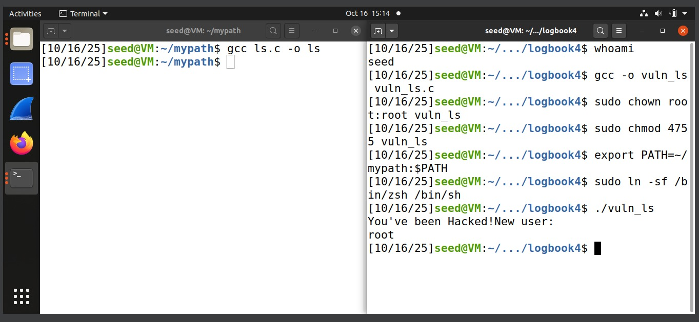

**Propósito técnico:**

- O bit Set-UID faz com que o processo herde privilégios de root quando executado por um utilizador normal.

- Como `system()` invoca o shell, este resolve ls consultando `PATH`; com o directório do atacante em primeiro lugar, o ls malicioso é selecionado.

- Em muitos sistemas dash evita a exploração ao dropar privilégios; a demonstração usa um shell alternativo apenas para ilustrar a consequência quando essa proteção não existe.
## Execução e verificação
O binário vulnerável foi executado; a saída do payload inclui uma mensagem e a execução de `whoami`, que devolveu `root`, confirmando execução com privilégios de administrador.

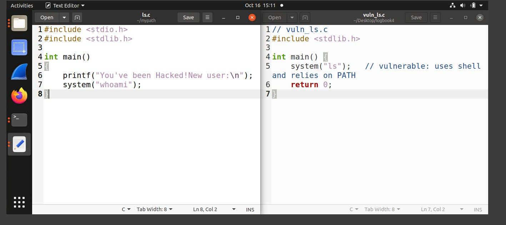

- `system("ls")` usa o shell e faz a resolução do comando via `PATH`. Se `PATH` for controlado por um atacante, o shell pode executar binários do atacante em vez dos binários do sistema.

- Um binário Set-UID executa com o EUID do owner (root), portanto qualquer processo filho herdará esse privilégio.

- A combinação (shell + PATH controlável + Set-UID) permite execução de código arbitrário com direitos elevados, a menos que existam mitigadores.

A alteração de `/bin/sh` foi temporária e reposta no final do experimento; todos os ficheiros de teste foram removidos.

# **Task 8: Invoking External Programs Using system() versus execve()**

Compilamos o programa e demos permissoes Set-UID com propriedade `root` e fizemos testes para verificar se está a funcionar como esperado.

De seguida foi feita uma tentativa de exploração usando metacaracteres e verificamos se o ataque foi bem sucedido, e ao tentar ler novamente, podemos verificar que o ataque foi efetuado com sucesso. 

O sucesso do programa deveu-se ao uso da função `system()` que invoca um shell para executar a string de comando e a shell interpretou o ponto e virgula como um separador de comandos, assim sendo ambos comandos foram executados.

Todoo processo foi feito com previlegios `root`, o comando `rm catall.txt` também. 

Respondendo a questão, o Bob pode pode comprometer a integridade do sistema e remover um arquivo sem permissão de escrita.

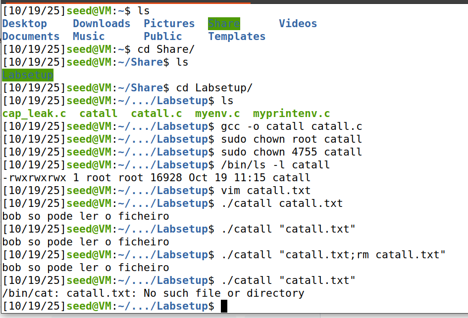