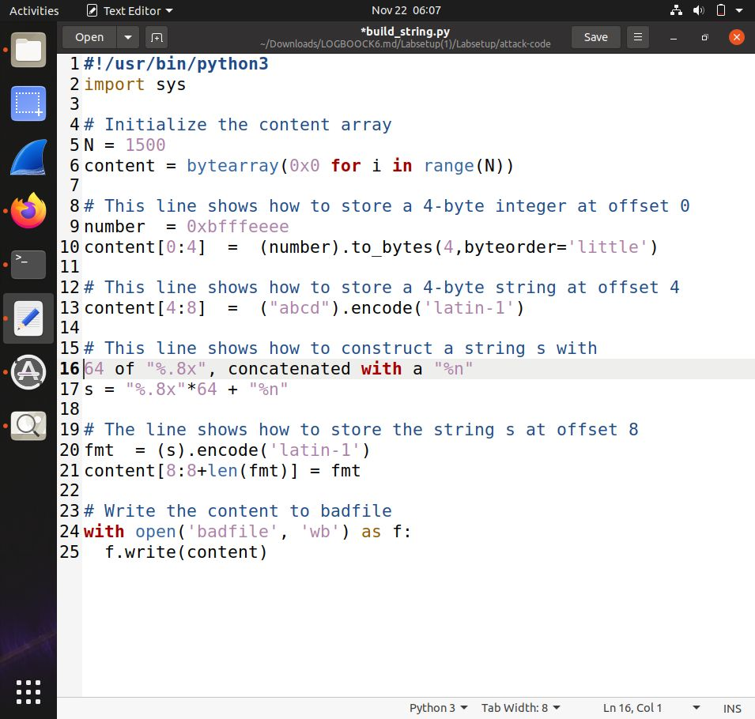
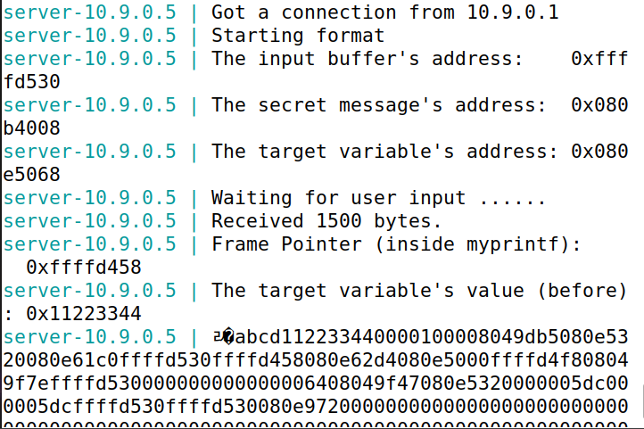
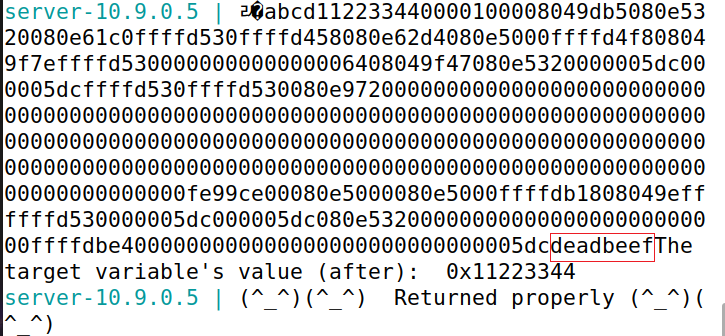
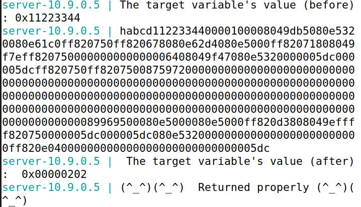
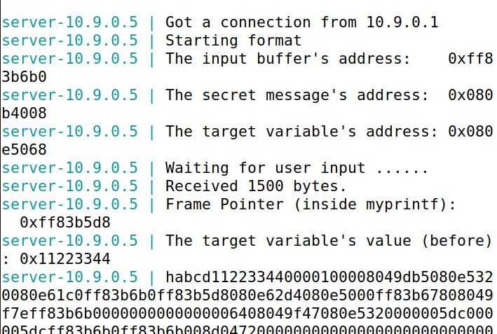
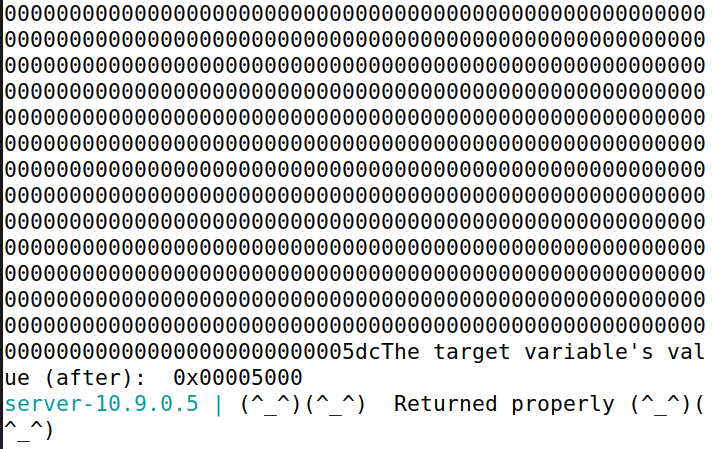

### Format-String Vulnerability Lab ###

Começamos por desativar a randomização de endereços:
* ~$ sudo sysctl -w kernel.randomize_va_space=0 *

O nosso programa-alvo vai ser format.c que tem uma vulnerabilidade de format string.
Vamos compilá-lo em 32bits e 64bits usando a Makefile (comando make):

Em seguida, copiamos o binário para a pasta fmt-containers, para ser usado pelos containers em Docker:

Vamos usar o Docker para construir um servidor local que vai ser alvo do nosso ataque. Começamos por construir a imagem Docker:
$ dcbuild

Por fim, executamos os containers a partir da imagem construída, criando o servidor:

**Task 1**

Nesta task, vamos usar o servidor com o IP 10.9.0.5, que executa um programa de 32 bits com a vulnerabilidade mencionada acima.

A port usada para o envio de inputs para o servidor será a 9090.

O nosso objetivo será crashar o programa que é executado em background no servidor.

Começamos por enviar uma mensagem benigna, para fins de teste, apenas imprimindo "hello":
$ echo hello | nc 10.9.0.5 9090
∧C

Note-se que, para obter o output da imagem acima, tivemos que abortar o comando dado, já que, como o Netcat (nc) não recebeu um sinal EOF (end of file) para encerrar a entrada, ele estava à espera de receber mais dados.

De modo a crashar o programa, apenas precisamos de enviar o especificador de formato "  %s "
que, como é impresso sozinho, sem nenhum argumento correspondente, vai tentar imprimir uma string armazenada num endereço aleatório. Como esse endereço não possui uma string armazenada nele, o programa crasha.

Podemos concluir que o programa crashou, pois não aparece impresso neste output "Returned properly".

### Task2: Printing Out the Server Program’s Memory

* Task 2.A: Stack Data

Para a realização desta tarefa, efetuámos algumas alterações no script build_string.py para criar um novo payload que permite imprimir os dados na stack.

Foram necessários 64 format specifiers %.8x para 0xdeadbeef ser impresso. 0xdeadbeef (4 bytes) foi colocado no início do payload e o valor, 64, foi obtido por tentativa e erro.

Compilámos o script build_string.py e enviámos o payload para o servidor:
$ python3 build_str ing.py
$ cat badfile | nc 10.9.0.5 9090

Execução do script build_string.py para gerar o ficheiro badfile com o payload para a Task 2A e envio do conteúdo de badfile ao servidor, mostrando o uso do comando nc para conectar ao endereço 10.9.0.5.

Observámos a consola do container para verificar o output da stack. Procurámos pelo número 0xdeadbeef nos valores impressos, o que confirma que estás a ler os dados corretos.

Print da consola do container, exibindo o conteúdo da stack e a confirmação do identificador 0xdeadbeef, indicando que o offset correto foi encontrado.

## Task3: Modifying the Server Program’s Memory

* Task 3.A: Change the value to a different value

Nesta tarefa, modificamos os primeiros 4 bytes do input, substituindo-os pelo endereço da target variable 0x080e5068, exibido na saída do servidor na etapa anterior ("The target variable's address: 0x080e5068"). Alteramos o último especificador de formato de %x para %n, de modo que o número de caracteres impressos pela função printf seja armazenado no endereço indicado, permitindo alterar o valor da variável para qualquer outro.

Compilámos o script build_string.py e enviámos o payload para o servidor:
$ python3 build_str ing.py
$ cat badfile | nc 10.9.0.5 9090

Observámos a consola do container para verificar o output da stack. A saída do container confirma que o valor original da variável target (0x11223344) foi alterado para 0x00000202, que corresponde a 514 em decimal. Isso indica que 514 caracteres foram impressos antes de printf processar o último especificador de formato.

* Task 3.B: Change the value to 0x5000

Nesta tarefa, o objetivo foi alterar o valor da variável target para 0x5000 (20480 em decimal) utilizando a exploração de vulnerabilidades de formatação de strings. Para alcançar esse resultado, foi necessário construir um payload que, ao ser processado, escrevesse o número total de caracteres impressos no endereço da variável target.

A técnica utilizada baseou-se no uso de modificadores de precisão em conjunto com format specifiers. Especificamente, a string de formatação construída foi:

# - "%.8x" * 62: Imprime 62 blocos de 8 dígitos hexadecimais cada, consumindo 496 caracteres.
# - "%.19976x": Imprime mais 19976 caracteres, totalizando 20472 caracteres adicionais.
# - "%n": Escreve o número total de caracteres impressos (20480 = 20472 + 8 caractéres do endereço) no endereço da variável target (0x080e5068). O payload gerado foi armazenado em um arquivo chamado badfile, contendo o endereço da variável target, seguido pela string de formatação.

Esse método permitiu a modificação do valor da variável target para 0x5000, conforme evidenciado no output do servidor, validando assim o sucesso da exploração.

Compilámos o script build_string.py e enviámos o payload para o servidor:
$ python3 build_str ing.py
$ cat badfile | nc 10.9.0.5 9090

Observámos a consola do container para verificar o output da stack. A saída do container confirma que o valor original da variável target (0x11223344) foi alterado para 0x5000.

