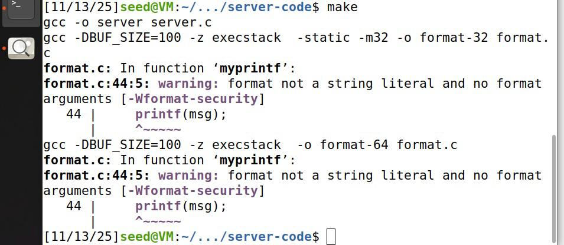
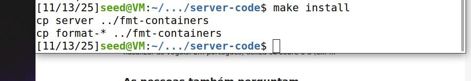
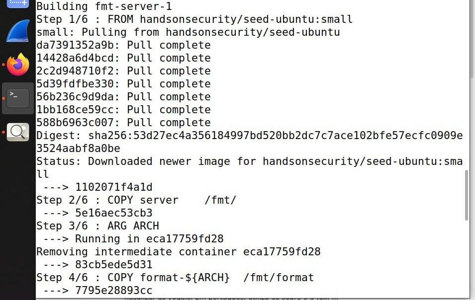
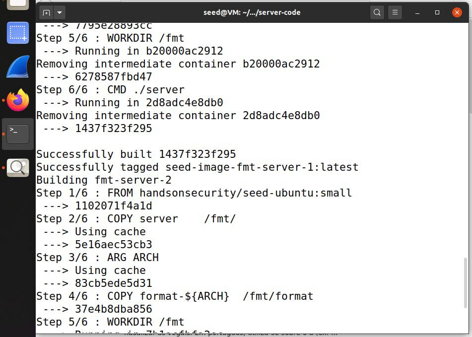
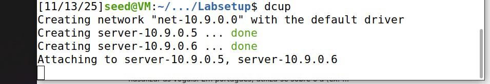
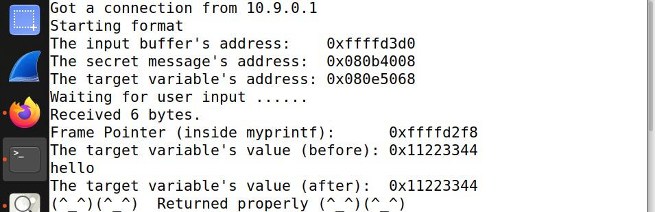
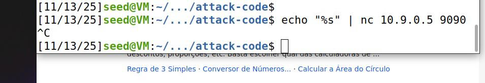
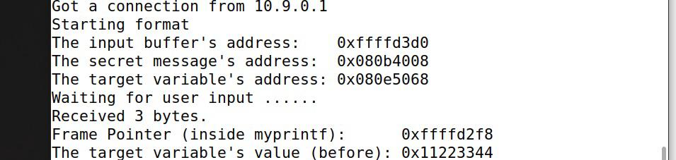

### Format-String Vulnerability Lab ###

Começamos por desativar a randomização de endereços:
* ~$ sudo sysctl -w kernel.randomize_va_space=0 *

O nosso programa-alvo vai ser format.c que tem uma vulnerabilidade de format string.
Vamos compilá-lo em 32bits e 64bits usando a Makefile (comando make):

Em seguida, copiamos o binário para a pasta fmt-containers, para ser usado pelos containers em Docker:

Vamos usar o Docker para construir um servidor local que vai ser alvo do nosso ataque. Começamos por construir a imagem Docker:
$ dcbuild

Por fim, executamos os containers a partir da imagem construída, criando o servidor:

**Task 1**

Nesta task, vamos usar o servidor com o IP 10.9.0.5, que executa um programa de 32 bits com a vulnerabilidade mencionada acima.

A port usada para o envio de inputs para o servidor será a 9090.

O nosso objetivo será crashar o programa que é executado em background no servidor.

Começamos por enviar uma mensagem benigna, para fins de teste, apenas imprimindo "hello":
$ echo hello | nc 10.9.0.5 9090
∧C

Note-se que, para obter o output da imagem acima, tivemos que abortar o comando dado, já que, como o Netcat (nc) não recebeu um sinal EOF (end of file) para encerrar a entrada, ele estava à espera de receber mais dados.

De modo a crashar o programa, apenas precisamos de enviar o especificador de formato "  %s "
que, como é impresso sozinho, sem nenhum argumento correspondente, vai tentar imprimir uma string armazenada num endereço aleatório. Como esse endereço não possui uma string armazenada nele, o programa crasha.

Podemos concluir que o programa crashou, pois não aparece impresso neste output "Returned properly".