# LOGBOOK 7 - Cross-Site Scripting (XSS) Attack Lab

## Introdução
Este relatório documenta a realização do laboratório de ataques Cross-Site Scripting (XSS) utilizando a aplicação web Elgg. O objetivo é compreender como vulnerabilidades XSS podem ser exploradas e os riscos que representam para aplicações web.

## Setup do ambiente

Primeiro, foi necessário adicionar as entradas DNS ao arquivo `/etc/hosts`.
Foram adicionadas as seguintes linhas:

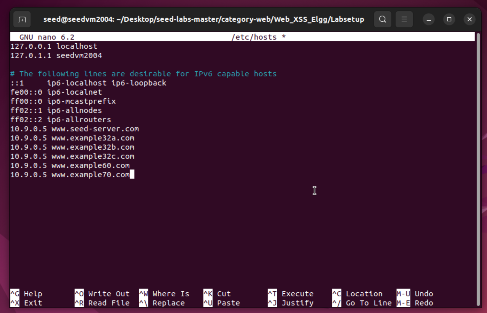

## Inicialização dos containers
No diretório `Labsetup-arm` (devido à arquitetura ARM64 da máquina virtual):

`docker-compose build`

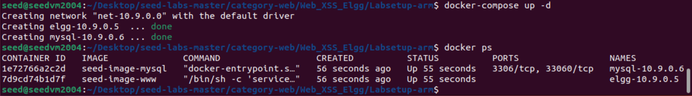

Após inicialização dos containers, a aplicação Elgg foi acessada através do navegador Firefox:
http://www.seed-server.com

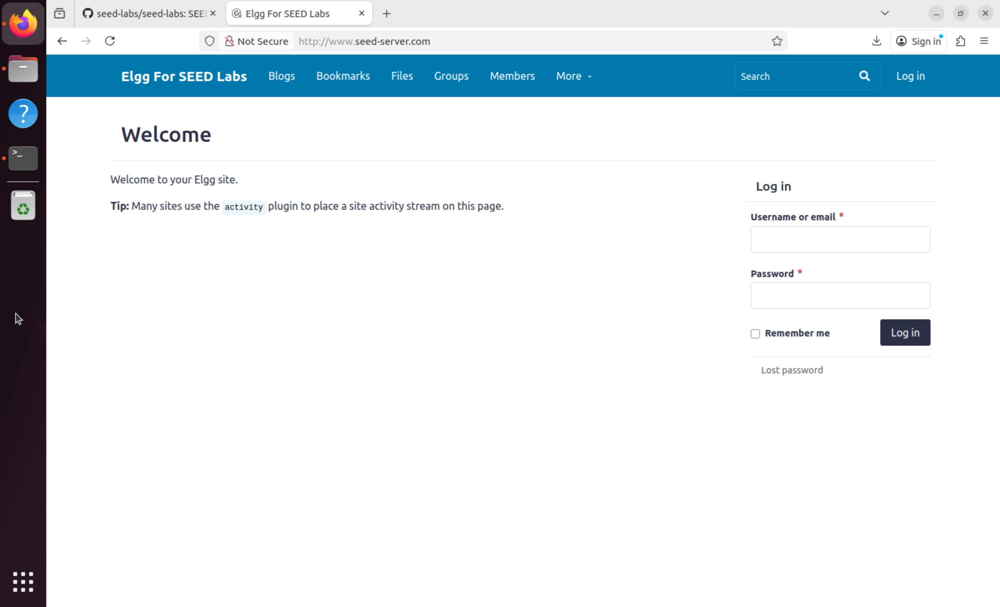

**Credenciais de teste utilizadas:**
- **Samy:** `samy` / `seedsamy` (atacante)
- **Alice:** `alice` / `seedalice` (vítima)
- **Boby:** `boby` / `seedboby` (vítima)

##  Task 1: Posting a Malicious Message to Display an Alert Window

**Objetivo:** Incorporar código JavaScript malicioso no perfil do Samy que exibe uma janela de alerta quando outro usuário visita o perfil.

### Procedimento:

1. Login como Samy (`samy` / `seedsamy`)
2. Navegar para "Edit profile"
3. No campo "Brief description", inserir o seguinte código:

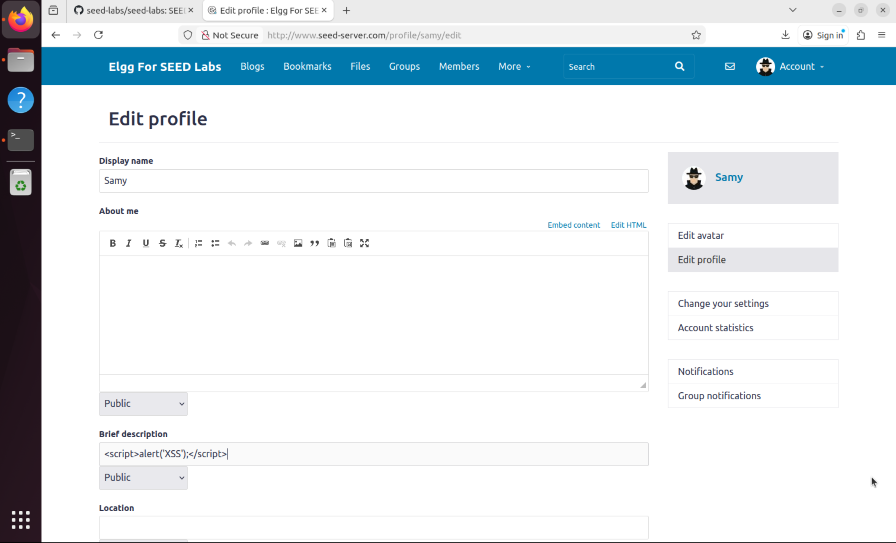

4. Salvar o perfil
5. Fazer logout e login como Alice
6. Visitar o perfil do Samy

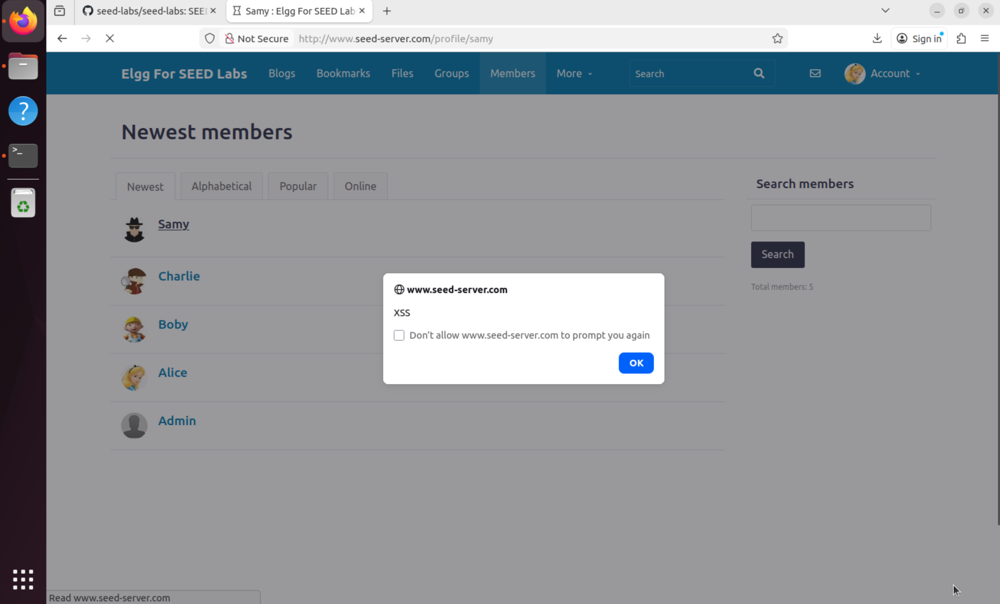

### Resultado:

Ao visitar o perfil do Samy, a Alice foi apresentada com uma janela de alerta contendo a mensagem "XSS".

Este ataque demonstra a vulnerabilidade XSS mais básica: **Stored XSS**. O código malicioso é:
- **Armazenado** permanentemente no banco de dados (perfil do Samy)
- **Executado automaticamente** no navegador de qualquer usuário que visite a página
- **Persistente** - continua a funcionar até ser removido.


##  Task 2: Posting a Malicious Message to Display Cookies

 **Objetivo:** Modificar o código JavaScript para exibir os cookies da sessão da vítima numa janela de alerta.

### Procedimento

1. Login como Samy
2. Editar o perfil
3. Modificar o código no campo "Brief description":

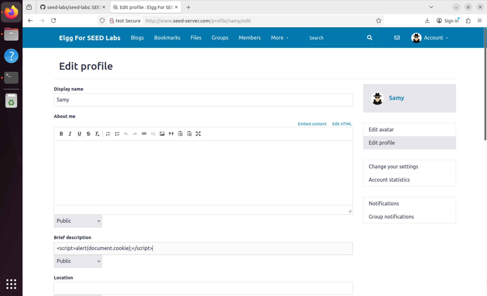

4. Salvar
5. Logout e login como Alice
6. Visitar o perfil do Samy

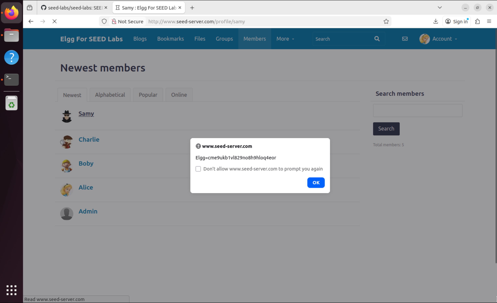

### Resultado:

A janela de alerta exibiu o cookie de sessão da Alice:
```
Elgg=cme9ukb1vl829no8h9hloq4eor
```
Este ataque demonstra como XSS pode ser usado para **roubar informações sensíveis**:

- **`document.cookie`** acessa todos os cookies HTTP acessíveis pelo JavaScript
- O **session cookie** (`Elgg=...`) identifica a sessão da Alice no servidor
- Com este cookie, um atacante poderia realizar **session hijacking**

**Limitação:** A vítima vê os seus próprios cookies, mas o atacante ainda não os recebe. 

## Task 3: Stealing Cookies from the Victim's Machine

**Objetivo:** Enviar os cookies da vítima para o servidor do atacante sem que a vítima perceba.

**Preparação do Servidor do Atacante:**
Num terminal separado, iniciar o netcat para receber as conexões:
```bash
nc -lknv 5555
```
### Código Malicioso

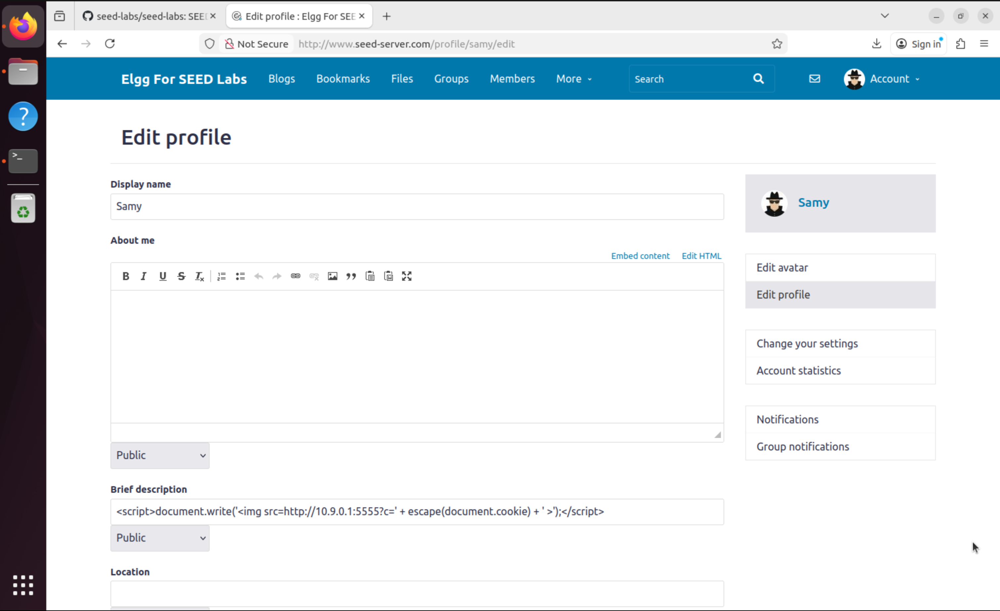

**Como funciona:**
1. `document.write()` injeta HTML dinamicamente na página
2. Cria uma tag `` com `src` apontando para o servidor do atacante
3. O navegador tenta carregar a "imagem", gerando uma requisição HTTP GET
4. Os cookies são enviados como parâmetro na URL (`?c=...`)
5. `escape()` codifica os cookies para URL encoding

Quando Alice visitou o perfil do Samy, o terminal com netcat capturou:

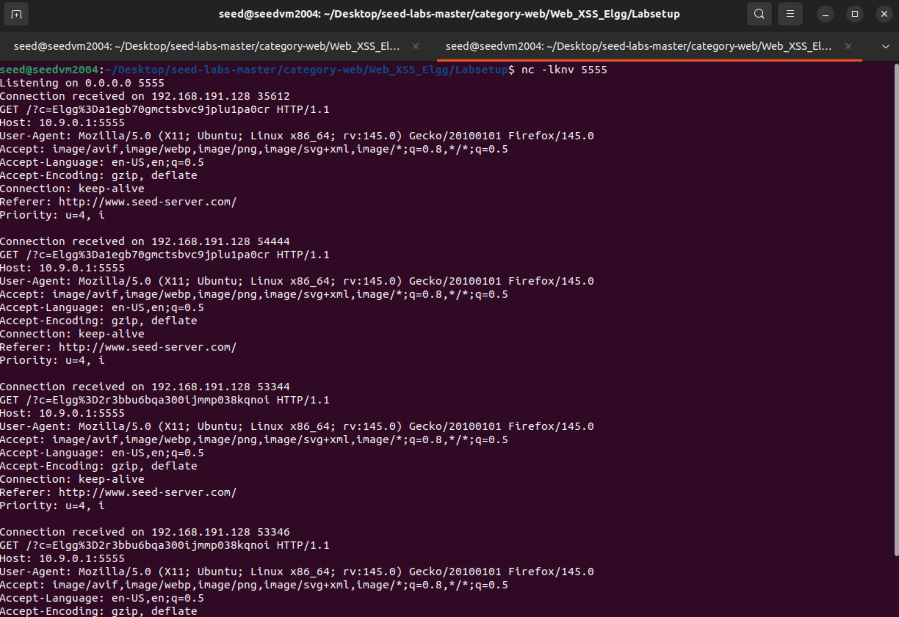

Este ataque é **silencioso e perigoso**:

 **Vantagens para o atacante:**
- A vítima não vê nenhuma janela de alerta
- Os cookies são enviados automaticamente
- O atacante recebe os cookies no seu servidor
- Pode ser usado para session hijacking

 **Impacto:**
Com os session cookies, o atacante pode:
- Personificar a vítima (session hijacking)
- Aceder à conta sem conhecer a palavra-passe
- Realizar ações em nome da vítima

##  Task 4: Becoming the Victim's Friend

**Objetivo:** Criar um ataque que adiciona automaticamente o Samy como amigo de qualquer utilizador que visite o seu perfil, forjando requisições HTTP sem intervenção do atacante.

Utilizando o Firefox Developer Tools:

1. Login como Alice
2. Visitar o perfil de Charlie
3. Clicar em "Add friend"
4. Analisar a requisição HTTP capturada

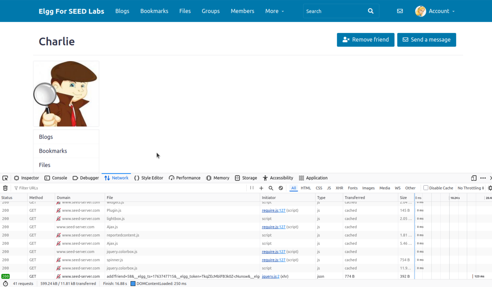

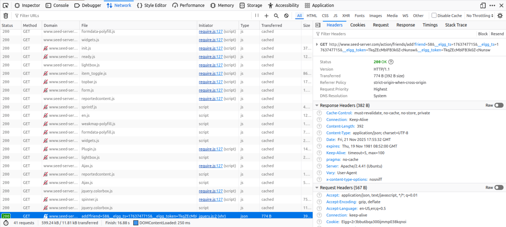

Para descobrir o GUID do Samy, utilizou-se o console do navegador:
```javascript
elgg.session.user.guid
```
**Resultado:** `59`

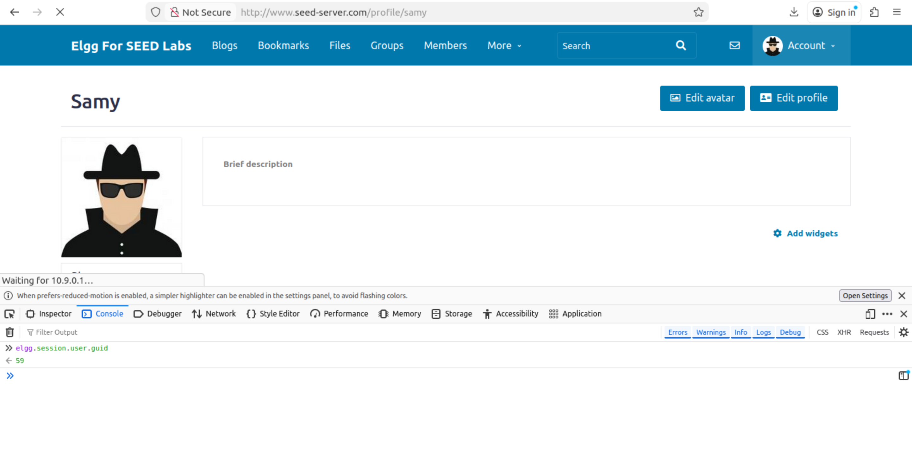

### Implementação do Ataque

No campo "About Me" do perfil do Samy (com "Edit HTML" ativado):

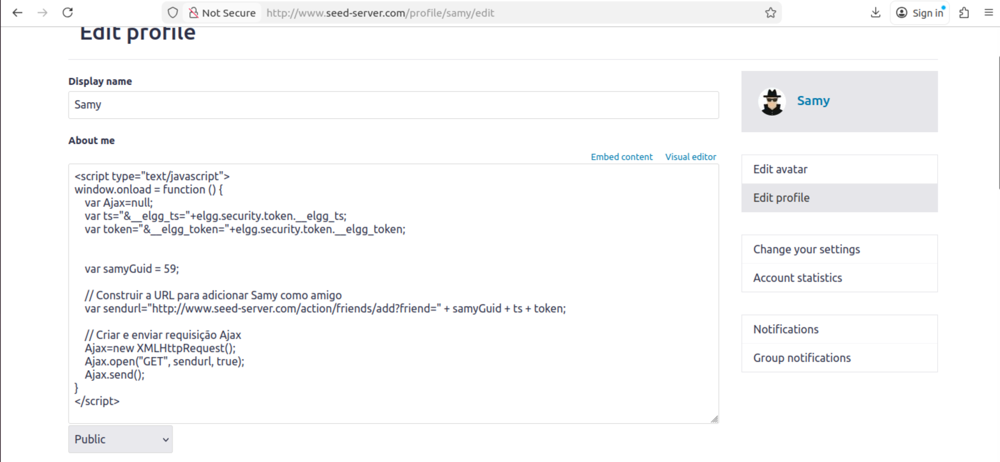

**Nota importante:** Foi necessário **remover códigos anteriores** do campo "Brief description" para evitar conflitos JavaScript.

### Teste do Ataque

Login como Boby e verificação dos amigos:

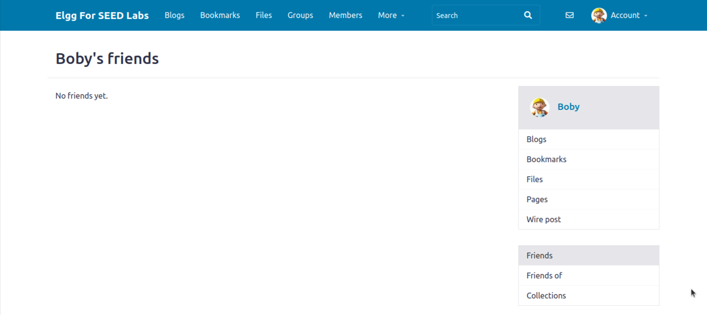

1. Com Boby logado, visitar o perfil do Samy
2. O JavaScript é executado automaticamente
3. Requisição Ajax é enviada em background

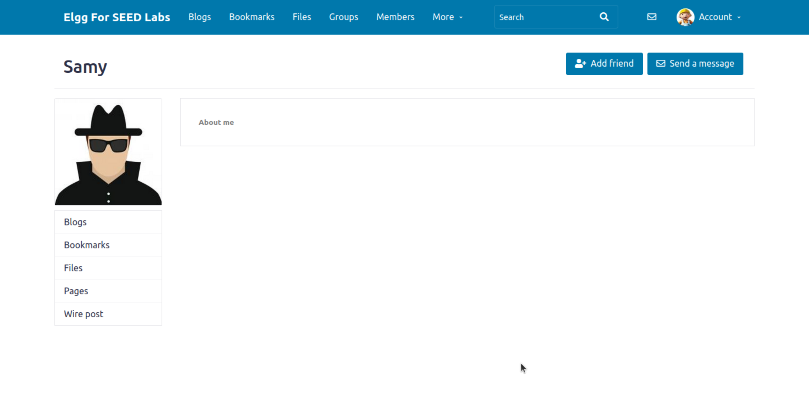

Após visitar o perfil do Samy, verificar novamente os amigos do Boby:

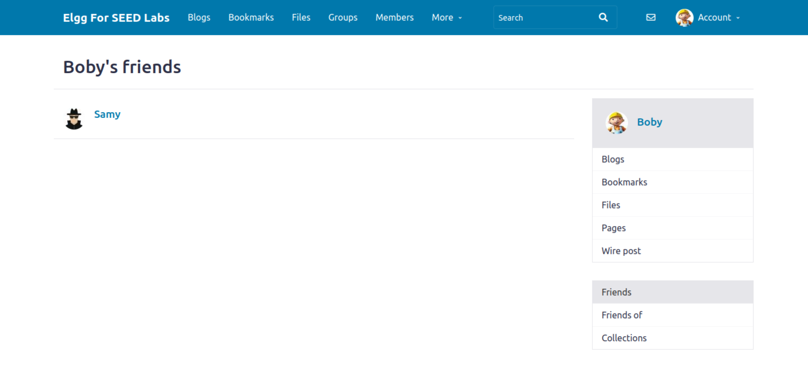

O Elgg implementa proteção **CSRF (Cross-Site Request Forgery)** através de:

1. **Timestamp (`__elgg_ts`)**: Validade temporal da requisição
2. **Token único (`__elgg_token`)**: Token ligado à sessão do utilizador

**Por que a proteção falha?**

O ataque XSS executa **no contexto da sessão da vítima**, tendo acesso legítimo aos tokens através do objeto JavaScript `elgg.security.token`. 


**Isto demonstra que:**
- CSRF tokens **NÃO protegem contra XSS**
- XSS é uma vulnerabilidade de **nível superior** que bypassa outras proteções
- A confiança no código client-side é quebrada


###  Respostas às Questões

#### Questão 1: Explique o propósito das linhas ① e ②. Por que são necessárias?

As linhas ① e ② obtêm os **tokens de proteção CSRF** da sessão atual do utilizador.

**Propósito:**
- **Linha ①**: Obtém o timestamp (`__elgg_ts`) que valida a temporalidade da requisição
- **Linha ②**: Obtém o token de segurança (`__elgg_token`) único por sessão

**Por que são necessárias:**

O Elgg implementa proteção **CSRF (Cross-Site Request Forgery)** que exige que todas as ações sensíveis (como adicionar amigo) incluam:
1. Um timestamp válido para evitar replay attacks
2. Um token de segurança ligado à sessão para validar origem

**Sem estes parâmetros**, o servidor Elgg rejeitaria a requisição com erro de validação CSRF.

#### Questão 2: Se o Elgg apenas fornecesse o Editor mode (sem Text mode), ainda seria possível lançar o ataque com sucesso?

**Sim, mas seria mais difícil e exigiria técnicas diferentes!**

Problema com Editor Mode:

O Editor mode adiciona automaticamente HTML extra (tags `<p>`, `<br>`, formatação) que pode:
- Quebrar a sintaxe do JavaScript
- Escapar caracteres especiais
- Adicionar tags desnecessárias que invalidam o código

**Técnicas alternativas para contornar:**

**1. Link Approach - Script Externo:**

Em vez de código inline, hospedar o JavaScript num servidor externo.


O Editor mode geralmente **não modifica** tags `<script>` com atributo `src`, permitindo o ataque.

**2. Event Handlers em Elementos HTML:**


Quando a imagem falha ao carregar, o código no `onerror` executa.

**3. Limpeza posterior com JavaScript:**

Injetar código que remove as tags extras adicionadas pelo editor.

#### Questão 3: Há várias modalidades de ataques XSS (Reflected, Stored ou DOM). Em qual/quais pode enquadrar este ataque e porquê?


Os ataques realizados neste lab são classificados como **Stored XSS (também chamado Persistent XSS)**.

1. **Armazenamento Permanente:**
   - O código malicioso é gravado na base de dados do servidor (perfil do Samy)
   - Persiste até ser explicitamente removido
   - Afeta todos os utilizadores que visitam a página infectada

2. **Execução Automática:**
   - Não requer ação especial da vítima além de visitar a página
   - Executa sempre que a página é carregada
   - Não depende de parâmetros URL ou inputs temporários

3. **Impacto Multiplicado:**
   - Um único payload atinge múltiplas vítimas
   - Propagação automática (worm-like behavior potencial)
   - Dano persistente e escalável